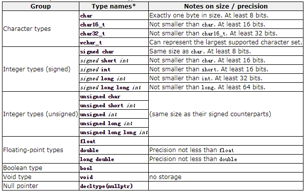

[TOC]

# Hello World

The source code of example:

```c++
// this is a "hello world" program.
#include <iostream>

int main() {
    std::cout << "Hello World!";
}
```

## Comments

C++ supports two ways of commenting code:

```c++
/* multi-line 
comment
*/

// single line comment
```

## Namespace

If you have seen C++ code before, you may have seen `cout` being used instead of `std::cout`. Both name the same object: the first one uses its **unqualified name** (`cout`), while the second qualifies it directly within the **namespace** `std` (as `std::cout`).

All the elements in the standard C++ library are declared within what is called a *namespace*: the namespace `std`.

In order to refer to the elements in the `std` namespace a program shall either qualify each and every use of elements of the library (as we have done by using prefix `std::`), or introduce visibility of its components by means of *using declarations*: `using namespace std;`.

For simplicity, and to improve readability, the examples in these tutorials will more often use this latter approach with *using* declarations, although note that **explicit qualification** is the only way to guarantee that name collisions never happen.

# Variables

We can now define variable as a portion of memory to store a value. 

* Each variable needs a name that identifies it and distinguishes it from the others. 
* Each variable needs a type to interpret its content of memory.

## Identifies

A valid identifier is a sequence of one or more letters, digits, or underscore characters (`_`). Spaces, punctuation marks, and symbols cannot be part of an identifier. In addition, identifiers shall always begin with a letter. They can also begin with an underline character (`_`), but such identifiers are -on most cases- considered reserved for compiler-specific keywords or external identifiers, as well as identifiers containing two successive underscore characters anywhere. In no case can they begin with a digit.

C++ uses a number of **reserved keywords** to identify operations and data descriptions; therefore, identifiers created by a programmer cannot match these keywords. Specific compilers may also have additional specific reserved keywords.

**Note:** The C++ language is a **case sensitive** language. That means that an identifier written in capital letters is not equivalent to another one with the same name but written in small letters.

## Types

The values of variables are stored somewhere in an unspecified location in the computer memory as zeros and ones. *Our program does not need to know the exact location where a variable is stored; it can simply refer to it by its name. What the program needs to be aware of is the kind of data stored in the variable.* It's not the same to store a simple integer as it is to store a letter or a large floating-point number; even though they are all represented using zeros and ones, they are not interpreted in the same way, and in many cases, they don't occupy the same amount of memory.

### Fundamental data types

Fundamental data types are basic types implemented directly by the language that represent the basic storage units supported natively by most systems. They can mainly be classified into:

- **Character types:** They can represent a single character, such as `'A'` or `'$'`. The most basic type is `char`, which is a one-byte character. Other types are also provided for wider characters.
- **Numerical integer types:** They can store a whole number value, such as `7` or `1024`. They exist in a variety of sizes, and can either be *signed* or *unsigned*, depending on whether they support negative values or not.
- **Floating-point types:** They can represent real values, such as `3.14` or `0.01`, with different levels of precision, depending on which of the three floating-point types is used.
- **Boolean type:** The boolean type, known in C++ as `bool`, can only represent one of two states, `true` or `false`.



Within each of the groups above, the difference between types is only their size (i.e., how much they occupy in memory): the first type in each group is the smallest, and the last is the largest, with each type being at least as large as the one preceding it in the same group. Other than that, the types in a group have the same properties.

The types described above (characters, integers, floating-point, and boolean) are collectively known as **arithmetic types**. But two additional fundamental types exist: `void`, which identifies the lack of type; and the type `nullptr`, which is a special type of pointer.

Note in the panel above that other than `char` (which has a size of exactly one byte), none of the fundamental types has a standard size specified (but a **minimum size**, at most). Therefore, the type is not required (and in many cases is not) exactly this minimum size. This does not mean that these types are of an **undetermined size**, but that there is no standard size across all compilers and machines; each compiler implementation may specify the sizes for these types that fit the best the architecture where the program is going to run. This rather generic size specification for types gives the C++ language a lot of flexibility to be adapted to work optimally in all kinds of platforms, both present and future. 

If the size or precision of the type is not a concern, then `char`, `int`, and `double` are typically selected to represent characters, integers, and floating-point values, respectively. The other types in their respective groups are only used in very particular cases.

The properties of fundamental types in a particular system and compiler implementation can be obtained by using the [numeric_limits](http://www.cplusplus.com/numeric_limits) classes (see standard header `<limits>`). If for some reason, types of specific sizes are needed, the library defines certain fixed-size type aliases in header `<cstdint>`.

### Compound data types

Fundamental types represent the most basic types handled by the machines where the code may run. But one of the major strengths of the C++ language is its rich set of compound types, of which the fundamental types are mere building blocks.

An example of compound type is the `string` class. Variables of this type are able to store sequences of characters, such as words or sentences. In order to use those compound types, the program needs to include the header where the type is defined within the standard library (header `<string>`).

## Declaration

C++ is a **strongly-typed language**, and requires every variable to be declared with its type before its first use. This informs the compiler the size to reserve in memory for the variable and how to interpret its value. 

### Variables declaration

The syntax to declare a new variable in C++ is straightforward: we simply write the type followed by the variable name (i.e., its identifier). Once declared, the variables can be used within the rest of their scope in the program. For example:

```c++
int a;
double b, c;
```

### Variables initialization

When the variables in the example above are declared, they have an **undetermined value** until they are assigned a value for the first time. But it is possible for a variable to have a specific value from the moment it is declared. This is called the **initialization** of the variable.

In C++, there are three ways to initialize variables. They are all equivalent and are reminiscent of the evolution of the language over the years:

* The first one, known as *c-like initialization* (because it is inherited from the C language): `int x = 0;`
* A second method, known as *constructor initialization* (introduced by the C++ language): `int x(0);`
* Finally, a third method, known as *uniform initialization* (this was introduced by the revision of the C++ standard, in 2011): `int x{0};`

### Compound types

```
#include <iostream>
#include <string>
using namespace std;

int main ()
{
  string s1 = "hello";
  string s2 = ("world");
  string s3 = {"!!"};
  return 0;
}
```

The `string` class is a *compound type*. As you can see in the example above, *compound types* are used in the same way as *fundamental types*: the same syntax is used to declare variables and to initialize them.

## Type deduction

When a new variable is initialized, the compiler can figure out what the type of the variable is automatically by the initializer. For this, it suffices to use `auto` as the type specifier for the variable:

```c++
int foo = 0;
auto bar = foo;  // the same as: int bar = foo; 
```

Variables that are not initialized can also make use of type deduction with the `decltype` specifier:

```c++
int foo = 0;
decltype(foo) bar;  // the same as: int bar;
```

**Note:** `auto` and `decltype` are powerful features recently added to the language. But the type deduction features they introduce are meant to be used either when the type cannot be obtained by other means or when using it improves code readability. The two examples above were likely neither of these use cases.

# Constants

Constants are expressions with a fixed value.

We have various ways to define constants:

* Literals
* Typed constants
* Preprocessor definitions

## Literals

Literals are the most obvious kind of constants. They are used to express particular values within the source code of a program.

Literal constants can be classified into: integer, floating-point, characters, strings, Boolean, pointers, and user-defined literals. There are two points we should consider:

* How to express the literals'  value
* How to declare the type of literals

### Integer literals

In addition to decimal numbers (those that most of us use every day), C++ allows the use of octal numbers (base 8) and hexadecimal numbers (base 16) as literal constants. For example:

```
int a = 75         // decimal
int b = 0113       // octal, preceded with zero
int c = 0x4b       // hexadecimal, preceded with 0x
```

These literal constants have a type, just like variables. By default, integer literals are of type `int`. However, certain suffixes may be appended to an integer literal to specify a different integer type:

| Suffix         | Type modifier |
| -------------- | ------------- |
| `u` *or* `U`   | `unsigned`    |
| `l` *or* `L`   | `long`        |
| `ll` *or* `LL` | `long long`   |

Unsigned may be combined with any of the other two in any order to form `unsigned long` or `unsigned long long`.

### Floating-point literals

For example:

```
double a = 3.14159    // 3.14159
double b = 6.02e23    // 6.02 x 10^23
double c = 1.6e-19    // 1.6 x 10^-19
```

The default type for floating-point literals is `double`. Floating-point literals of type `float` or `long double`   can be specified by adding one of the following suffixes:

| Suffix       | Type          |
| ------------ | ------------- |
| `f` *or* `F` | `float`       |
| `l` *or* `L` | `long double` |

### Character and string literals

otice that to represent a single character, we enclose it between single quotes (`'`), and to express a string (which generally consists of more than one character), we enclose the characters between double quotes (`"`). For example:

```
char c = 'a';
string s = "abc";
```

Character and string literals can also represent special characters that are difficult or impossible to express otherwise in the source code of a program, like newline (`\n`) or tab (`\t`). These special characters are all of them preceded by a backslash character (`\`).

Several string literals can be concatenated to form a single string literal simply by separating them by one or more blank spaces, including tabs, newlines, and other valid blank characters. For example:

```
string s = "hello" "world" "!";
```

Some programmers also use a trick to include long string literals in multiple lines: In C++, a backslash (`\`) at the end of line is considered a *line-continuation* character that merges both that line and the next into a single line. For example:

```
string s = "hello \
world !";
```

All the character literals and string literals described above are made of characters of type `char`. A different character type can be specified by using one of the following **prefixes**:

| Prefix | Character type |
| ------ | -------------- |
| `u`    | `char16_t`     |
| `U`    | `char32_t`     |
| `L`    | `wchar_t`      |

For string literals, apart from the above `u`, `U` and `L`, two additional **prefixes** exist:

| Prefix | Description                                                 |
| ------ | ----------------------------------------------------------- |
| `u8`   | The string literal is encoded in the executable using UTF-8 |
| `R`    | The string literal is a raw string                          |

### Keyword literals

Three keyword literals exist in C++: `true`, `false` and `nullptr`:

* `true` and `false` are the two possible values for variables of type `bool`.
* `nullptr` is the null pointer value.

For example:

```
bool b = true;
int* p = nullptr;
```

## Typed constants

Sometimes, it is just convenient to give a name to a constant value, so we can use them in many places:

```
const double PI = 3.14;
```

## Preprocessor definitions

 Another mechanism to name constant values is the use of preprocessor definitions. They have the following form:

```
#define identifier replacement
```

After this directive, any occurrence of `identifier` in the code is interpreted as `replacement`, where replacement is any sequence of characters (until the end of the line). This replacement is performed by the preprocessor, and happens before the program is compiled, thus causing a sort of blind replacement: the validity of the types or syntax involved is not checked in any way.  

# Operators

Once introduced to variables and constants, we can begin to operate with them by using *operators*. What follows is a complete list of operators. At this point, it is likely not necessary to know all of them, but they are all listed here to also serve as reference.

## Assignment operator

For example:

```
x = y;
```

This statement assigns to variable `x` the value contained in variable `y`. The value of `x` at the moment this statement is executed is lost and replaced by the value of `y`.

Assignment operations are expressions that can be evaluated. That means that the assignment itself has a value, and for fundamental types this value is the one assigned in the operation. For example:

```
x = 2 + (y=5); // equal to y=5; x=2+y;
```

The following expression is also valid in C++: 

```
x = y = z = 5;
```

## Arithmetic operators 

The five arithmetical operations supported by C++ are: 

| operator | description    |
| -------- | -------------- |
| `+`      | addition       |
| `-`      | subtraction    |
| `*`      | multiplication |
| `/`      | division       |
| `%`      | modulo         |

## Compound assignment operators

Compound assignment operators modify the current value of a variable by performing an operation on it. They are equivalent to assigning the result of an operation to the first operand:

| expression            | equivalent to...             |
| --------------------- | ---------------------------- |
| `y += x;`             | `y = y + x;`                 |
| `x -= 5;`             | `x = x - 5;`                 |
| `x /= y;`             | `x = x / y;`                 |
| `price *= units + 1;` | `price = price * (units+1);` |

## Increment and decrement operators

Some expression can be shortened even more: the increase operator (`++`) and the decrease operator (`--`) increase or reduce by one the value stored in a variable. They are equivalent to `+=1` and to `-=1`, respectively.

A peculiarity of this operator is that it can be used both as a prefix and as a suffix. That means that it can be written either before the variable name (`++x`) or after it (`x++`). Although in simple expressions like `x++` or `++x`, both have exactly the same meaning; in other expressions in which the result of the increment or decrement operation is evaluated, they may have an important difference in their meaning: In the case that the increase operator is used as a prefix (`++x`) of the value, the expression evaluates to the final value of `x`, once it is already increased. On the other hand, in case that it is used as a suffix (`x++`), the value is also increased, but the expression evaluates to the value that x had before being increased.

## Relational and comparison operators

Two expressions can be compared using relational and equality operators. The result of such an operation is either true or false (i.e., a Boolean value).

The relational operators in C++ are:

| operator | description              |
| -------- | ------------------------ |
| `==`     | Equal to                 |
| `!=`     | Not equal to             |
| `<`      | Less than                |
| `>`      | Greater than             |
| `<=`     | Less than or equal to    |
| `>=`     | Greater than or equal to |

## Logical operators

The operator `!` is the C++ operator for the Boolean operation NOT. It has only one operand, to its right, and inverts it, producing `false` if its operand is `true`, and `true` if its operand is `false`. 

The operator `&&` corresponds to the Boolean logical operation AND, which yields `true` if both its operands are `true`, and `false`otherwise.

The operator `||` corresponds to the Boolean logical operation OR, which yields `true` if either of its operands is `true`, thus being false only when both operands are false.

When using the logical operators, C++ only evaluates what is necessary from left to right to come up with the combined relational result, ignoring the rest. Therefore, in the last example (`(5==5)||(3>6)`), C++ evaluates first whether `5==5` is `true`, and if so, it never checks whether `3>6` is `true` or not. This is known as **short-circuit evaluation**.

## Conditional ternary operator

The conditional operator evaluates an expression, returning one value if that expression evaluates to `true`, and a different one if the expression evaluates as `false`. Its syntax is:

```
condition ? result1 : result2
```

## Comma operator

The comma operator (`,`) is used to separate two or more expressions that are included where only one expression is expected. When the set of expressions has to be evaluated for a value, only the right-most expression is considered.

For example, the following code:  

```
a = (b=3, b+2);  // a will be assgined to 5
```

## Bitwise operators

Bitwise operators modify variables considering the bit patterns that represent the values they store.

| operator | asm equivalent | description                      |
| -------- | -------------- | -------------------------------- |
| `&`      | `AND`          | Bitwise AND                      |
| `|`      | `OR`           | Bitwise inclusive OR             |
| `^`      | `XOR`          | Bitwise exclusive OR             |
| `~`      | `NOT`          | Unary complement (bit inversion) |
| `<<`     | `SHL`          | Shift bits left                  |
| `>>`     | `SHR`          | Shift bits right                 |

## Explicit type casting operators

Type casting operators allow to convert a value of a given type to another type. There are several ways to do this in C++.

The simplest one, which has been inherited from the C language, is to precede the expression to be converted by the new type enclosed between parentheses:

```
int i;
float f = 3.14;
i = (int)f;
```

Another way to do the same thing in C++ is to use the functional notation preceding the expression to be converted by the type and enclosing the expression between parentheses:

```
i = int(f);
```

Both ways of casting types are valid in C++.

## The sizeof operator

This operator accepts one parameter, which can be either a **type or a variable**, and returns the size in bytes of that type or object:

```
int l = sizeof(3.14F);
int s = sizeof(double);
```

The value returned by `sizeof` is a **compile-time constant**, so it is always determined before program execution.

# Input/Output

## Streams

C++ uses a convenient abstraction called *streams* to perform input and output operations in sequential media such as the screen, the keyboard or a file. A stream is an entity where a program can either insert or extract characters to/from. There is no need to know details about the media associated to the stream or any of its internal specifications. All we need to know is that streams are a source/destination of characters, and that these characters are provided/accepted sequentially (i.e., one after another).

he standard library defines a handful of stream objects that can be used to access what are considered the standard sources and destinations of characters by the environment where the program runs:

| stream | description                      |
| ------ | -------------------------------- |
| `cin`  | standard input stream            |
| `cout` | standard output stream           |
| `cerr` | standard error (output) stream   |
| `clog` | standard logging (output) stream |

We are going to see in more detail only `cout` and `cin` (the standard output and input streams); `cerr` and `clog`  are also output streams, so they essentially work like `cout`, with the only difference being that they identify streams for specific purposes: error messages and logging; which, in many cases, in most environment setups, they actually do the exact same thing: they print on screen, although they can also be individually redirected.

## Standard output

On most program environments, the standard output by default is the screen, and the C++ stream object defined to access it is `cout`.

For formatted output operations, `cout` is used together with the *insertion operator*, which is written as `<<`. The `<<` operator inserts the data that follows it into the stream that precedes it.

Multiple insertion operations (<<) may be chained in a single statement:

```
cout << "I am " << age << " years old and my zipcode is " << zipcode;
```

To insert a line break, a new-line character shall be inserted at the exact position the line should be broken. In C++, a new-line character can be specified as `\n`. Alternatively, the `endl` manipulator can also be used to break lines.

The `endl` manipulator produces a newline character, exactly as the insertion of `'\n'` does; but it also has an additional behavior: the stream's buffer (if any) is flushed, which means that the output is requested to be physically written to the device, if it wasn't already. This affects mainly *fully buffered* streams, and `cout` is (generally) not a *fully buffered* stream. Still, it is generally a good idea to use `endl` only when flushing the stream would be a feature and `'\n'` when it would not. Bear in mind that a flushing operation incurs a certain overhead, and on some devices it may produce a delay.

## Standard input

In most program environments, the standard input by default is the keyboard, and the C++ stream object defined to access it is `cin`.

For formatted input operations, `cin` is used together with the extraction operator, which is written as `>>`. This operator is then followed by the variable where the extracted data is stored. Once the statement with the extraction operation on `cin` is reached, the program will wait for as long as needed until some input is introduced.

The extraction operation on `cin` uses the type of the variable after the `>>` operator to determine how it interprets the characters read from the input; if it is an integer, the format expected is a series of digits, if a string a sequence of characters, etc. For example:

```
int i;
cin >> i;
```

What happens in the example above if the user enters something else that cannot be interpreted as an integer? Well, in this case, the extraction operation fails. And this, by default, lets the program continue without setting a value for variable `i`, producing undetermined results if the value of `i` is used later. This is very poor program behavior. Most programs are expected to behave in an expected manner no matter what the user types, handling invalid values appropriately. Only very simple programs should rely on values extracted directly from `cin` without further checking.  

## Input strings

The extraction operator can be used on `cin` to get strings of characters in the same way as with fundamental data types. However, `cin` extraction always considers spaces (whitespaces, tabs, new-line...) as terminating the value being extracted, and thus extracting a string means to always extract a single word, not a phrase or an entire sentence.

To get an entire line from `cin`, there exists a function, called `getline`, that takes the stream (`cin`) as first argument, and the string variable as second. For example:

```c++
#include <iostream>
#include <string>
using namespace std;

int main ()
{
  string mystr;
  cout << "What's your name? ";
  getline (cin, mystr);
  cout << "Hello " << mystr << ".\n";
  return 0;
}
```

The standard behavior that most users expect from a console program is that each time the program queries the user for input, the user introduces the field, and then presses ENTER (or RETURN). That is to say, input is generally expected to happen in terms of lines on console programs, and this can be achieved by using `getline` to obtain input from the user. Therefore, unless you have a strong reason not to, you should always use `getline` to get input in your console programs instead of extracting from `cin`.

## The stringstream

The standard header `<sstream>` defines a type called `stringstream` that allows a string to be treated as a stream, and thus allowing extraction or insertion operations from/to strings in the same way as they are performed on `cin` and `cout`. This feature is most useful to convert strings to numerical values and vice versa. For example:

```c++
#include <iostream>
#include <string>
#include <sstream>
using namespace std;

int main ()
{
  string mystr;
  float price=0;
  int quantity=0;

  cout << "Enter price: ";
  getline (cin,mystr);
  stringstream(mystr) >> price;
  cout << "Enter quantity: ";
  getline (cin,mystr);
  stringstream(mystr) >> quantity;
  cout << "Total price: " << price*quantity << endl;
  return 0;
}
```

With this approach of getting entire lines and extracting their contents, we separate the process of getting user input from its interpretation as data, allowing the input process to be what the user expects, and at the same time gaining more control over the transformation of its content into useful data by the program.


